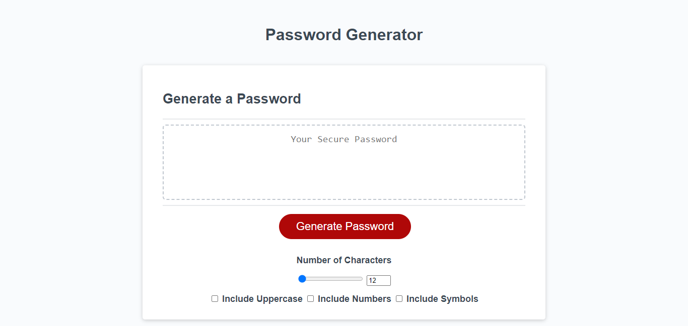

# Password Generator Starter Code
## Password Genereator

-Web app that generates a random password from lower case, uppercase, numbers, symbols.
-To provide a user with a secure password.
-A user can select the length 12 -128 characters. 
-HTML, CSS, Javascript used.
## Instalation

N/A

## Usage
This website to create a secure password with up to 128 characters and can be selected to have lower case, uppercase, numbers, symbols.

## Credits

N/A

## License

Please refer to the LICENSE in the repo.

## Links and image for site
https://mwalker35-stack.github.io/challenge-3/

https://github.com/mwalker35-stack/challenge-3

